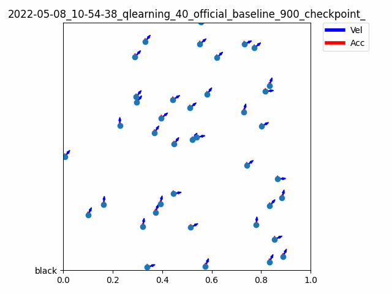

# RLFlocking
A Reinforcement Learning based Flocking Project




This is the discrete policy branch of our project. Some of the code structure is borrowed from the programming assignment's skeleton code and this [repository](https://github.com/xuehy/pytorch-maddpg/).

To run the Sarsa baseline:
```
python3.8 discrete.py --num_agents 40 --num_episodes 1000 --algorithm qlearning --gamma 0.95 --epsilon 0.05 --hidden 32 --comment official_baseline --checkpoint_frequency 100
```

To run the Q-learning baseline:
```
python3.8 discrete.py --num_agents 40 --num_episodes 1000 --algorithm qlearning --gamma 0.95 --epsilon 0.05 --hidden 32 --comment official_baseline --checkpoint_frequency 100
```
